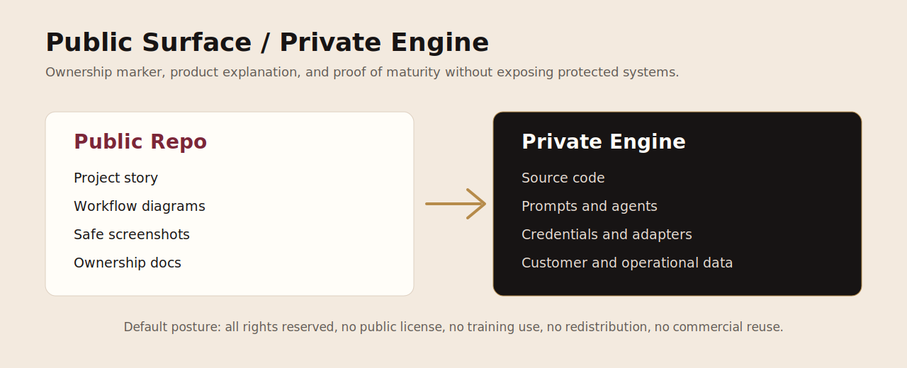

# Public / Private Boundary

## Public

- README and product summary
- public-safe visuals
- workflow diagrams
- status, roadmap, FAQ
- ownership, commercial use, security, privacy review
- WordPress page draft

## Private

- source code and private adapters
- local queues and telemetry
- raw receipts and screenshots
- credentials and tokens
- deployment systems
- raw Pepperdine coursework
- private family, legal, medical, benefits, customer, or unpublished creative material

## Boundary Rule

Public materials may describe what Fantasia does and why it matters. They must not expose how the private engine operates at an implementation level that compromises ownership, security, privacy, or leverage.
